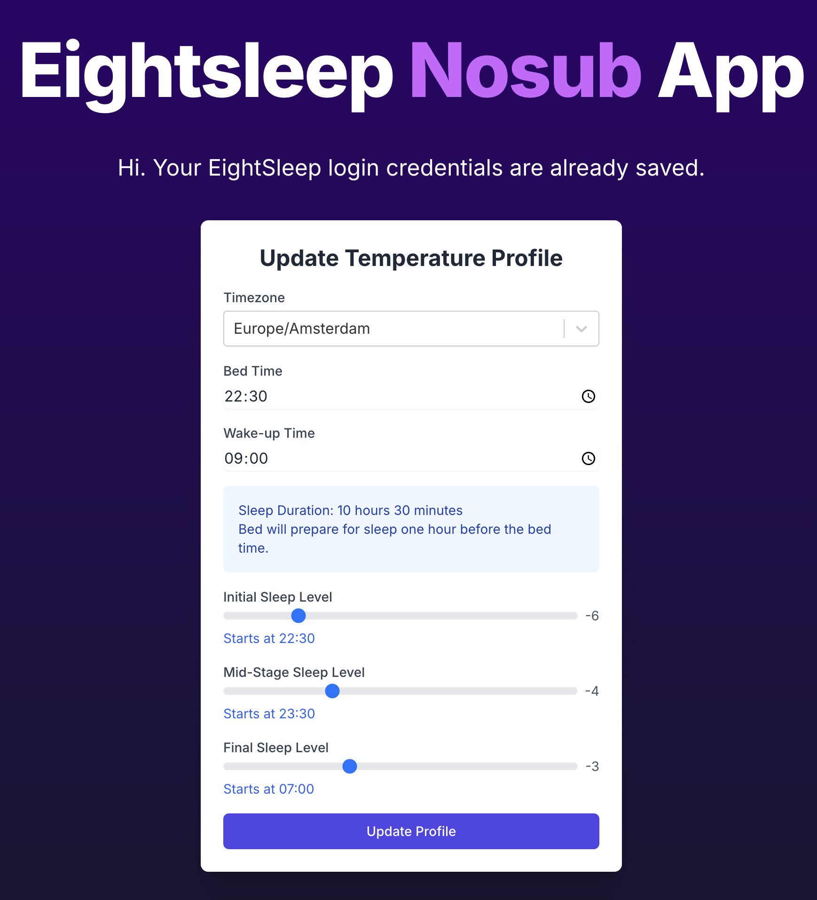

# Eight Sleep Control App

This WebApp is an alternative interface to control any Eight Sleep mattress. It gives the user the ability to schedule the temperature throughout the night without the need for an Eight Sleep subscription. This is achieved by not using Eight Sleep's "Smart Scheduling" feature, but instead running a recurring script every 30 minutes to adjust the temperature based on the schedule. If you share your mattress, both of you will be able to log in to your accounts and control your side of the mattress.

## How to use this app yourself

In the following, I will explain how to self-host this webapp on Vercel so that you can control it from anywhere. The setup will not generate any costs. It should take about 15 minutes to complete, **no coding skills required**.

1. Set up a (free) GitHub Account
2. Set up a (free) Vercel Account using your GitHub Account as the Login Method
3. On this GitHub Page, click the "Fork" Button to make a copy of this repository, and follow the steps, renaming the project to whatever you want.
4. Go to your Vercel Dashboard and create a new Project
5. You are now in the process of creating a new project on Vercel.
    - In "Import Git Repository" select your forked project
    - At "Configure Project" select the "Environment Variables" Section and create the three needed Environment Variables (`CRON_SECRET`, `JWT_SECRET`, `APPROVED_EMAILS`) and set the two Secrets to a random string of your choice. [E.g. use this site](https://it-tools.tech/token-generator). Save the **CRON_SECRET**, you will need it in a moment. 
    - Set APPROVED_EMAILS to a comma-separated list of emails that are allowed to log in to the app. This is so that no one except you (and potentially your partner) can log in to the app.
    - Continue and the project will be built. **The first build will fail, which is expected**.
    - Click "Go to Project"
6. Two more settings in Vercel
    - In the project, click the "Settings" Tab
    - In the "General" tab under "Build & Development Settings" override the "Build Command" to `npm run build && npm run db:push` and **press the save button**.
    - In the "Deployment Protection" Tab, disable "Vercel Authentication" at the very top.
7. Add database to project
    - In the project, click the "Storage" Tab
    - Click "Create Database"
    - Select "Postgres", then "accept", then "create", then "connect" (all defaults are fine in between)
8. Rebuild project
    - In the project, click the "Deployments" Tab.
    - Select the 3 dots next to the previously failed build and click "Redeploy"
9. Test the app
    - Go to the main "Project" Tab
    - On the top right click "Visit"
    - Welcome to your new App! Save the URL, we will need it in a second. Also save it as a bookmark for future use.
    - Try to log in to the app with your Eight Sleep Login. This will work now.
    - Important: **Set up a Temperature profile now!** or the next step will fail. You can change it later.
10. Activate the recurring Update of the Mattress
    - Go to [cron-job.org](https://cron-job.org/en/) and set up a free account
    - Create a new "Cron Job"
    - Title can be anything
    - URL: `https://YOUR_VERCEL_URL/api/temperatureCron` e.g. `https://eightsleep-nosub-app-efwfwfwf-aerotows-projects.vercel.app/api/temperatureCron`
    - Set it to every 30 minutes
    - Under the "Advanced" Tab add a "Header"
        - Key: `Authorization`
        - Value: `Bearer YOUR_CRON_SECRET` (note the space after Bearer, include the word Bearer and the space!)
    - Click "TEST RUN", then "START TEST RUN" and make sure that the "TEST RUN STATUS" is "200 OK"
    - Click "Save"

Enjoy! That's it!

## How to Upgrade from an older Version?

Check the [Release Notes](https://github.com/aerotow/eightsleep-nosub-app/releases) to see what changed. I will include steps you have to do there to upgrade. After you have read the notes there and made potential changes, make sure to go to your GitHub fork and sync to the latest commit of this repository. It's just one click at the top.

## Credits

- Thanks to @lukas-clarke for his Home Assistant package eight_sleep and pyEight which gave me the idea of the possibility to use the API of the app.
- Thanks also to @mezz64 for the initial work on his pyEight package.
- Thanks to the @t3-oss team for the great T3 boilerplate on which this codebase is based.

## Disclaimer

### IMPORTANT: Please read this disclaimer carefully before using this software.

This project is an unofficial, independent effort and is not affiliated with, endorsed by, or supported by Eight Sleep, Inc. in any way. The software provided here interacts with Eight Sleep's systems through reverse-engineered methods and is not using any officially sanctioned API.

**Key Points:**

- **Unofficial Project**: This is not an official Eight Sleep product. Use it at your own risk.
- **No Warranty**: This software is provided "as is", without warranty of any kind, express or implied.

**Potential Risks:**

- Using this software may violate Eight Sleep's Terms of Service.
- It could potentially lead to account suspension or other actions by Eight Sleep.
- Future updates to Eight Sleep's systems may break this software's functionality.

**Data Security**: While we strive to handle data securely, we cannot guarantee the same level of security as Eight Sleep's official apps. Use caution when handling sensitive information.

**Legal Considerations**: The legality of reverse engineering and using unofficial APIs can vary by jurisdiction. Ensure you understand the legal implications in your area.

**No Liability**: The developers of this project are not responsible for any damages or losses, including but not limited to, damages related to data loss, service interruption, or account issues.

**Use Responsibly**: This tool is intended for personal use only. Do not use it to access or modify data of Eight Sleep accounts you do not own or have explicit permission to manage.

By using this software, you acknowledge that you have read this disclaimer, understand its contents, and agree to use the software at your own risk. If you do not agree with these terms, do not use this software.

Always prioritize the official Eight Sleep app for critical functions and data management related to your Eight Sleep products.